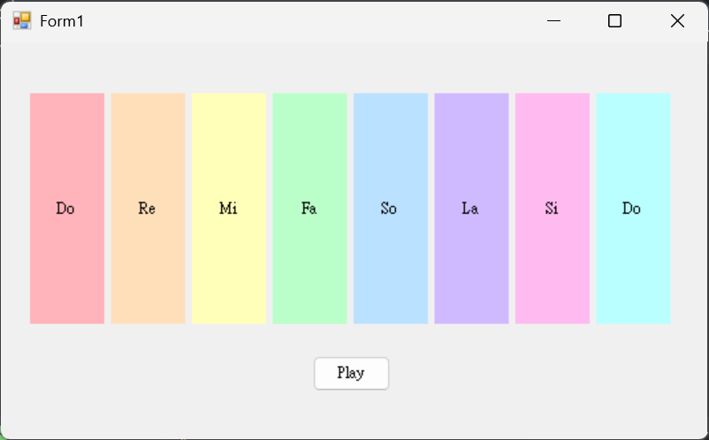
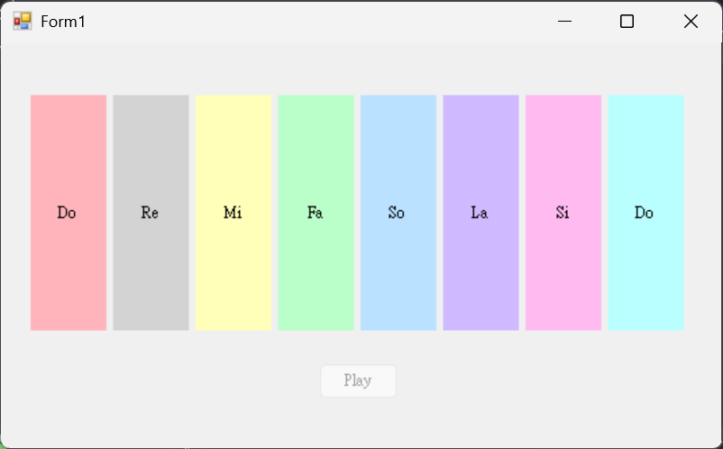

## 簡易電子琴
使用 Win API 的 `Beep()` 函式搭配 8 顆按鈕，模擬 Do、Re、Mi、Fa、Sol、La、Si、Do 八個音階；教材示範以 `TabIndex = 0~7` 對應頻率陣列，並讓多個按鈕共用同一個 Click 事件。

**功能：**
- 8 個按鈕對應 8 個音階。
- 點擊按鈕即可播放對應頻率音效。
- 可使用共用事件處理函式簡化程式碼。
- 多添加自動演奏功能可以自動演奏小蜜蜂，有灰底提示目前按下哪一鍵。
  

  

**使用技術：**
- Windows Forms
- `System.Runtime.InteropServices`
- `[DllImport("kernel32.dll")]`
- `Beep(int frequency, int duration)`
